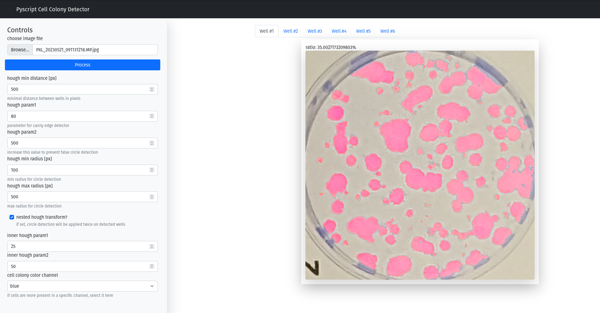

# pyscript-bootstrap-templates


This package provides tools to write single page Dashboard apps with python that run entirely client-side in the Browser.
To do this, it uses [pyscript](https://pyscript.net/) and builds python wrapper classes for various [bootstrap](https://getbootstrap.com/) elements.



* examples (Code is in [examples](./examples/)):
    * [Hello World](https://antielektron.github.io/pyscript_bootstrap_templates/examples/01_hello_world)
    * [scikit-image sobel filter](https://antielektron.github.io/pyscript_bootstrap_templates/examples/02_image_filter)
    * [numpy grid demo](https://antielektron.github.io/pyscript_bootstrap_templates/examples/03_numpy_grid_demo)
    * [cell colony detector using opencv](https://antielektron.github.io/pyscript_bootstrap_templates/examples/04_cell_detector)

## installation

```bash
pip install git+https://the-cake-is-a-lie.net/gogs/jonas/pyscript-bootstrap-templates.git
```

## usage


### create a project
to create a new project, run

```bash
pyscript_bootstrap_app create <project_name> <title> --packages PACKAGES [PACKAGES ...]
```

* this will create a new folder containing a PWA app skeleton to start with.
The main entry point should be in main.py

* this will also create all necessary files such that this app can operate as an standalone PWA application.

* the `packages` parameter is optional, you can specify on which PyPi packages your code depends
  * **NOTE**: since pyscript's python implementation depends on WASM and it's limited in what it can do, not pure python packages may not work. Here is a list of supported packages: https://pyodide.org/en/stable/usage/packages-in-pyodide.html

### update a project
Since it's a pwa, browsers will cache all content of the app for offline usage. To bump the version of the PWA and trigger a redownload after the project has changed,
simply run 

```bash
pyscript_bootstrap_app update <project_name> <title>
```

### serving a project for development

you can use python's builtin webserver to serve the files locally for testing. Just run

```bash
python -m http.server 1111
```

inside your project folder and navigate to http://localhost:1111 in your browser

### advanced usage
There are a few more options you can pass to `pyscript_bootstrap_app` (e.g. the pyscript version that is used). Here is the full list:

```bash
usage: pyscript_bootstrap_app [-h] [--packages PACKAGES [PACKAGES ...]] [--paths PATHS [PATHS ...]] [--pyscript-css-url PYSCRIPT_CSS_URL] [--pyscript-js-url PYSCRIPT_JS_URL]
                              [--pyscript-py-url PYSCRIPT_PY_URL] [--bootstrap-css-url BOOTSTRAP_CSS_URL] [--bootstrap-js-url BOOTSTRAP_JS_URL]
                              [--pyscript-bootstrap-templates-wheel-url PYSCRIPT_BOOTSTRAP_TEMPLATES_WHEEL_URL] [--pwa-bg-color PWA_BG_COLOR] [--pwa-theme-color PWA_THEME_COLOR]
                              {create,update} root_folder title

create a new pyscript project

positional arguments:
  {create,update}
  root_folder           the root folder of the new project
  title                 the title of the new project

options:
  -h, --help            show this help message and exit
  --packages PACKAGES [PACKAGES ...]
                        the packages to include in the new project
  --paths PATHS [PATHS ...]
                        additional local python files to include in the new project
  --pyscript-css-url PYSCRIPT_CSS_URL
                        the url of the pyscript css file
  --pyscript-js-url PYSCRIPT_JS_URL
                        the url of the pyscript js file
  --pyscript-py-url PYSCRIPT_PY_URL
                        the url of the pyscript py file
  --bootstrap-css-url BOOTSTRAP_CSS_URL
                        the url of the bootstrap css file
  --bootstrap-js-url BOOTSTRAP_JS_URL
                        the url of the bootstrap js file
  --pyscript-bootstrap-templates-wheel-url PYSCRIPT_BOOTSTRAP_TEMPLATES_WHEEL_URL
                        the url of the pyscript bootstrap templates wheel file
  --pwa-bg-color PWA_BG_COLOR
                        background color for pwa configuration
  --pwa-theme-color PWA_THEME_COLOR
                        theme color for pwa configuration
```
